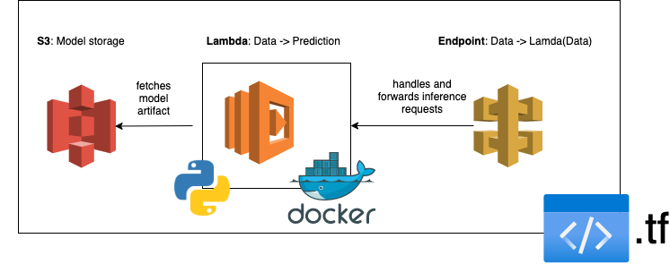

# Serverless & containerized ML model using AWS Lambda, API Gateway and Terraform

<p align="center">
  
</p>

### Goal:

Have an endpoint which can serve model predictions:

```
$ curl \
$  -X POST \
$  --header "Content-Type: application/json" \
$  --data '{"sepal_length": 5.9, "sepal_width": 3, "petal_length": 5.1, "petal_width": 1.8}' \
$  https://my-endpoint-id.execute-api.eu-central-1.amazonaws.com/predict/
{"prediction": {"label": "virginica", "probability": 0.9997}}
```
